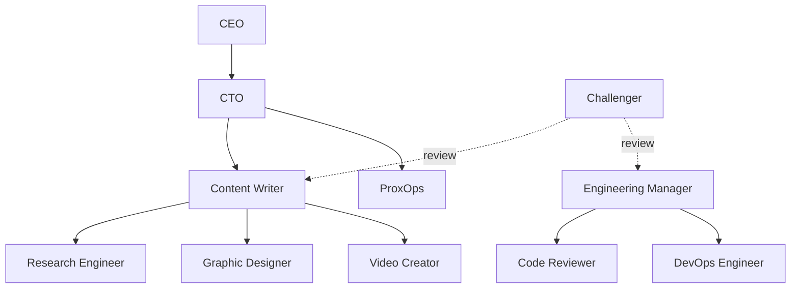

# Agents Overview

This catalog contains eight production agents from IsItObservable Labs. Each is shareable on its own — adopt the full crew or just the one you need.

## Roster

| Agent | Title | Reports to | Best for |
|-------|-------|-----------|----------|
| [Research Engineer](research-engineer.md) | Technical Research & Demo Planning | Content Writer | Weekly ecosystem scans (OTel + Cloud Native), contributor tracking |
| [Code Reviewer](code-reviewer.md) | Adversarial Code Review (Amelia) | Engineering Manager | Quality gate on PRs before merge |
| [DevOps Engineer](devops-engineer.md) | DevOps & CI/CD Engineer | Engineering Manager | CI/CD, Docker, Helm, container scanning, docs deploys |
| [Content Writer](content-writer.md) | Content Producer & Script Writer | CTO | Blogs, newsletters, show notes, slide decks |
| [Graphic Designer](graphic-designer.md) | Visual Designer & Diagram Artist | Content Writer | Diagrams, icons, branded visuals |
| [Video Creator](video-creator.md) | Video Production Specialist | Content Writer | Intros, explainers, social clips, livestream assets |
| [ProxOps](proxops.md) | Homelab Infrastructure Operator | CEO | Proxmox/homelab ops, proxy & network topology |
| [Challenger](challenger.md) | Research & Devil's Advocate | cross-cutting | Adversarial review, edge-case hunting, prose & structural editing |

## Skills by agent

Every agent receives the two core Paperclip skills — **`paperclip`** (control-plane: tickets, comments, delegation, governance) and **`para-memory-files`** (per-agent file memory) — plus shared **MemPalace MCP** for cross-agent knowledge. The table below lists the *additional* skills and external tooling each agent leans on, taken from its `AGENTS.md` persona.

| Agent | Additional skills & tooling |
|-------|------------------------------|
| Research Engineer | `gh` CLI (GitHub API), curated `news-sources.yaml`, MemPalace contributor/release tracking |
| Code Reviewer | `bmad-code-review` (Blind Hunter / Edge Case Hunter / Acceptance Auditor layers) |
| DevOps Engineer | GitHub Actions, Docker `buildx` (multi-arch), Helm (OCI), Trivy, Syft/CycloneDX SBOM, MkDocs |
| Content Writer | `ppt-master` (slide decks), `blog-*` writing suite, `python-docx`, Gmail & Google Drive MCP |
| Graphic Designer | `beautiful-mermaid`, `d3-viz`, `design-guide`, FLUX image generation (`bfl-api` / `flux-best-practices`) |
| Video Creator | OpenMontage pipelines, `ffmpeg`, `elevenlabs` / `music` / `acestep` (audio), `manim-composer`, `ai-video-gen` |
| ProxOps | Proxmox/homelab ops, Gateway API routing, cluster manifest tooling |
| Challenger | `bmad-review-adversarial-general`, `bmad-review-edge-case-hunter`, `bmad-editorial-review-prose`, `bmad-editorial-review-structure`, MemPalace systemic-issue tracking |

!!! tip "Skills are the authoritative install list"
    Each agent's own `AGENTS.md` declares the skills it uses. The [add flow](../adding-an-agent.md) installs those skills before importing the agent, so references always resolve.

## Org chart

The Challenger is a **cross-cutting quality gate** rather than a fixed report — the dotted lines show it reviewing work across teams. The solid reporting lines above reflect how the rest of the crew runs at IsItObservable Labs. When you import a single agent, you can re-parent it under your own manager — see [Adding an Agent](../adding-an-agent.md#attach-the-agent-to-your-org-chart).

## A shared shape

Every agent page on this site follows the same structure so you can compare them quickly:

1. **Role** — what the agent is responsible for
2. **How it works** — its routine, workflow, or review model
3. **Skills & tools** — what to install alongside it
4. **Collaboration** — who it hands off to and receives from
5. **How to add it** — the one command to provision it
