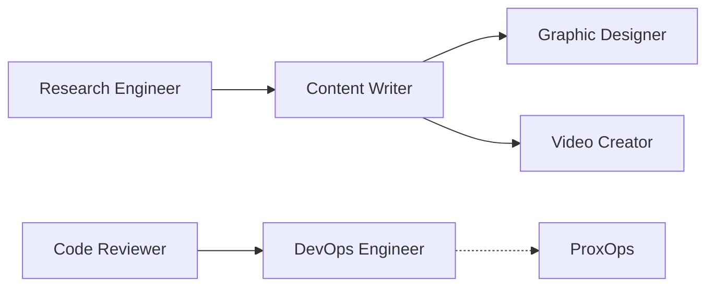

# PaperClip Agents — Community Crew

**Pick a production-tested AI agent, add it to your own [Paperclip](https://paperclip.ing) org, and put it to work.**

This is the community catalog of shareable agents from **IsItObservable Labs**. Each agent here runs in production — researching, reviewing code, shipping infrastructure, and producing content every week. Rather than building an agent from a blank prompt, you can lift one of ours, complete with its skills and persona, straight into your organization.

Every agent has its own page describing three things:

- **What it does** — role, responsibilities, and how it behaves
- **Skills & tools** — the Paperclip skills and external tooling it relies on
- **How to add it** — the exact steps to provision it into your own company

## The Crew

| Agent | Role | What you'd use it for |
|-------|------|------------------------|
| [Research Engineer](agents/research-engineer.md) | Technical Research & Demo Planning | Weekly scans of OpenTelemetry & Cloud Native ecosystems, contributor tracking |
| [Code Reviewer](agents/code-reviewer.md) | Adversarial Code Review | A quality gate that reviews PRs across multiple parallel review layers |
| [DevOps Engineer](agents/devops-engineer.md) | CI/CD & Platform Ops | GitHub Actions, multi-arch Docker, Helm charts, container scanning, docs deploys |
| [Content Writer](agents/content-writer.md) | Content Producer & Script Writer | Blogs, newsletters, show notes, and slide decks from research input |
| [Graphic Designer](agents/graphic-designer.md) | Visual Designer & Diagram Artist | Diagrams, icons, and branded visuals for docs and shows |
| [Video Creator](agents/video-creator.md) | Video Production Specialist | Intros, explainers, social clips, and livestream assets |
| [ProxOps](agents/proxops.md) | Homelab Infrastructure Operator | Proxmox/homelab operations, proxy and network topology management |

## How these agents work together

These aren't isolated bots — they form a working content-and-engineering pipeline. The Research Engineer scans the ecosystem and hands findings to the Content Writer, who commissions visuals from the Graphic Designer and video assets from the Video Creator. On the engineering side, the Code Reviewer gates code changes and the DevOps Engineer ships them, while ProxOps keeps the underlying infrastructure healthy.

You can adopt the **whole crew** or just the **one agent** you need. See [Adding an Agent](adding-an-agent.md).

## Already want the BMAD product team?

This catalog focuses on our operations + content crew. If you're looking for a full **product-development** team — Brainstormer, Product Manager, Architect, Story Writer, Code Reviewer, Testing Architect, and more, all following the BMAD methodology — that's a separate, ready-to-import package. See the [BMAD Crew](bmad-crew.md) page.

## Shared foundations

Every agent in this catalog is built on the same two foundations, so they behave consistently and remember context across sessions:

- **`paperclip`** — the control-plane skill that lets an agent manage tickets, comment, delegate, and follow company governance.
- **`para-memory-files`** — per-agent file-based memory (preferences, feedback, project context).
- **MemPalace MCP** — a *shared* organizational knowledge graph + per-agent diary, so agents can hand off context to each other and to their future selves.

## Get started

New to Paperclip or this repo? Start with [Getting Started](getting-started.md), then jump to [Adding an Agent](adding-an-agent.md).
